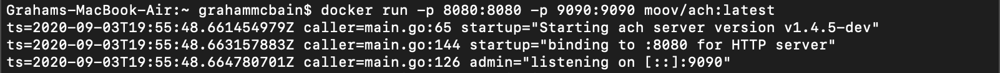

## How and when to use the Moov ACH Library
The Moov team was founded by industry veterans who have been dealing with legacy technology for decades. It’s this experience that led to the creation of our open source projects like ACH. What we noticed was that teams across the financial industry are consistently solving the same problem, often causing huge headaches. The information around how to solve these problems is freely available but it’s buried in lengthy manuals and layers upon layers of insider Jargon. 

With our ACH library and other projects, Moov has set out to build modular solutions that follow best practices and modern development techniques. By building clearly documented un-opinionated implementations of the core ACH spec we enable more people to use this powerful payment rail. Before we talk about who might want to use this powerful project, lets talk about the workflow that it covers. 

### ACH project workflow
ACH is a versatile payment rail that has a wide range of use cases. We have found that one of the most difficult parts of the entire process is generating the notoriously persnickety ACH files themselves. These are their own proprietary format with a long list of rules. That’s why our ACH project is hyper focused on creating Nacha compliant ACH files. 

Because of the wide range of uses for ACH we’ll describe how this project works in the context of one of the most common scenarios, payroll. In the example a company is trying to send out payroll via ACH to its employees. This requires that they deliver an ACH file to their bank with the appropriate information and in the compliant format. 


When we essay “deliver” we’re referring to the fact that often Banks will have web portals, or in some cases an API. Customers with appropriate access can directly upload ACH files that are then forwarded on to the FED. In the diagram above we assume that like many companies the payroll information is kept in an Excel file. That file’s data needs to be converted into a Nacha Compliant ACH file format and that’s where our ACH project comes in.

### Who is ACH for?
We have found that the people who are interested in this project need to send a lot of ACH debits/credits. This may be companies that process payments for B2B customers, sometimes it’s challenger banks who are handling direct deposits for their customers. Whatever the use case it’s someone who has go to the trouble of getting programmatic access to send ACH files to their baking partner. In some cases they don’t have that access and are looking to use the project as a way to make the transition to programmatic access smoother. 

There is an extremely long tail of edge cases that can come up when working with these files. If you’re manually creating files and uploading them you can deal with these issues as they arise. When writing code however you can’t redeploy your infrastructure when you come across a problem if you need to get your payments out by the cutoff time. 

This is where the Moov ACH project really shines. Our open source community is constantly submitting fixes for this long tail of issues. By using this project you’re able to benefit from the work of payments professionals across the country. This not having to relearn a seemingly endless list of nitpicks will save you time. 

We’re extremely grateful for the people who have made pull requests to this project because they are making it better for everyone. If you’re researching how to improve your ACH processing we welcome you to join the community and start asking questions. We also hold regular working group sessions to discuss ways to improve the project. 


### How to use the open source Moov ACH service?
Like all Moov projects the Moov ACH service is available via a public docker image. This means that getting the service up and running to test it out is quick and easy. Before we get started playing around make sure you have Docker installed and running on your local machine. 

[Docker](https://docs.docker.com/get-docker/)

Once installed you’ll just need to pull down the docker image we offer on docker hub:

```bash
docker pull moov/ach
```

Upon success you’ll want to run build and run the container with this command:

```bash
docker run -p 8080:8080 -p 9090:9090 moov/ach:latest
```

Your terminal will show that the Docker container is now running on port 9090:



With that running you can start to make calls to the server. Let’s use some of the test data provided in the project to post a file to the server and then look at the result. With the Docker container still running, open a new tab in your terminal and navigate to the ```ach``` folder. From the root of that project run the following ```CURL``` command:

```bash
curl -XPOST --data-binary "@./test/testdata/ppd-debit.ach" http://localhost:8080/files/create
```

This command grabs a test file and posts it to the ```/create``` endpoint. This should return a response that shows the ID of the file you’ve created:

```bash
{"id":"c58b_YOUR_UNIQUE_FILE_ID_6b93","error":null}
```

The file you published was already in ```.ach``` format. To view that file in JSON you can simply run another ```CURL``` command from your terminal using the ID returned to you in the previous call:

```bash
curl http://localhost:8080/files/c58b_YOUR_UNIQUE_FILE_ID_6b93
```

This will return a ```JSON``` file with all the data from the test file. This is just scratching the service of the capabilities of this project but we want you to see how simple it is to deploy it and start making calls.

### When not to use the Moov ACH library
While we have made it extremely easy to deploy the ACH project, it’s actually the easy part of offering ACH transfers in your product. Beyond code there are a slew of organizational burdens that you as a company will need to manage if you’re going to handle ACH yourself. Specifically if you want to go this route here are some of the boxes you'll need to check:

- Setting up a direct relationship with a Bank (ODFI in fintech speak)
- Complying with your ODFI's interpretation of Nacha guidelines
- Handling returns(a biggie) and supplying proof of authorization by SEC code


For some companies who have a deep knowledge of ACH and banking infrastructure these issues are managable. But for startups or companies who just want to add a feature to their otherwise non-financial product it may not be worth the effort to take on these responsobilities. 

For those in the latter category who just want to offer their customers more seamless financial experience, it may make more sense to use something like the Moov hosted service. Under this scenario Moov hosts ACH (and other services) on it’s servers and an established relationship with an ODFI. If this is something you’re interested in, you can signup for the beta by clicking the “Get early Access” button on the top of Moov.io.

Whatever path you choose you’re always welcome to connect with our community in the [Moov slack channel](https://slack.moov.io/). We’re building a strong community of payments professionals who are always willing to share best practices for solving the hardest problems in fintech.
