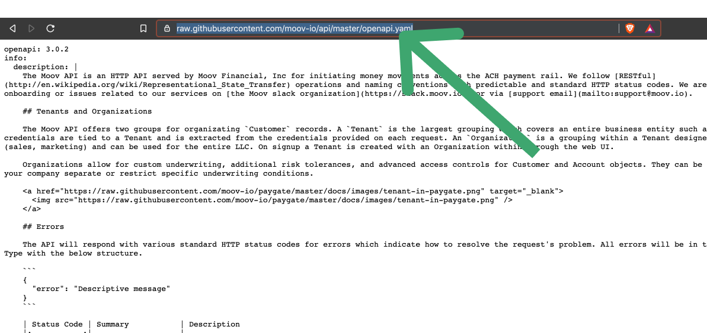
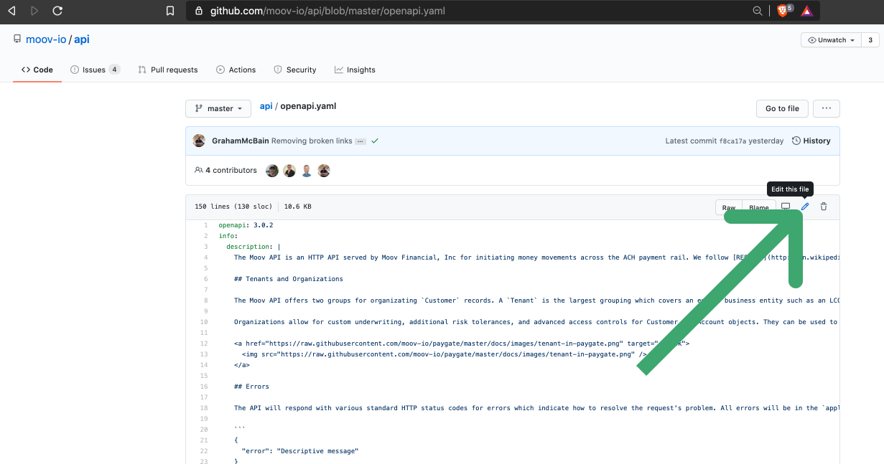
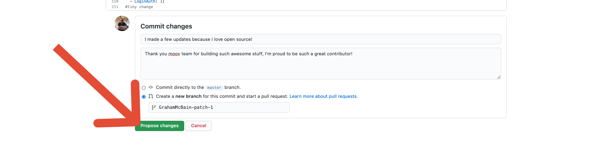
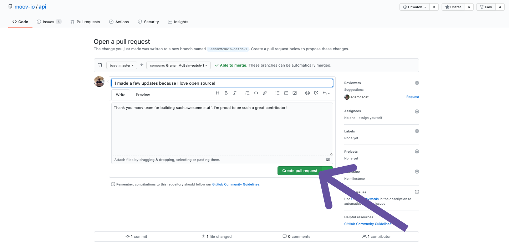

In [Part 1]() we covered how to make a pull request against docs.moov.io on Github.

The [Moov documentation](https://docs.moov.io) is here to serve the community. We’re always interested in feedback from those using the service and especially thankful to anyone willing to contribute to it. In an effort to make contributions as easy as possible in this guide we’ll map out how to quickly and easily suggest changes to our documentation.

Oftentimes when you see an issue in an open source project the instructions for making changes are so daunting that it’s easier to just ignore them. We’re all about making your development easier and so contributing to our docs should be a similar experience. 



## API Documentation

While you’re reading through the API documentation and you run across an issue you can make an edit very quickly. First you need to grab the yaml file which contains the documentation:

1. Navigate to: [https://github.com/moov-io/api](https://github.com/moov-io/api)
2.  Click on the openapi.yaml file
3.  Click on the “Raw” button in the upper right corner
4. Copy the URL of the raw .yaml file

Now you can open up a new tab and import this raw .yaml file into the Swagger Editior, an in browser editor for working with .yaml files:

1. Navigate to editor.swagger.io
2. click file > import url
3. paste the url you copied of the raw yaml file and click “ok

Now you should see the moov API docs appear in a split screen in your browser. This allows you to immediately see what your changes will look like. 

When you’ve made all the changes you like you can now navigate back to github and suggest your changes! 

1. Copy entirety of your edited yaml file from swagger editor
2. Click the “edit this file” button on github 
3. Replace Openapi.yaml text with your new version 
4. Add a commit message and help text at the bottom of the page
5. select “Create a new branch for this commit and start a pull request
6. click “propose changes

Once you’ve completed these steps you will be redirected to the final step, creating a new pull request with your changes! The only thing left to do is click the “create a pull request” button.

That’s it! You’ve successfully done your part in moving us all closer to a more inclusive and accessible financial system! 