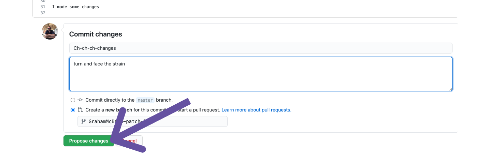
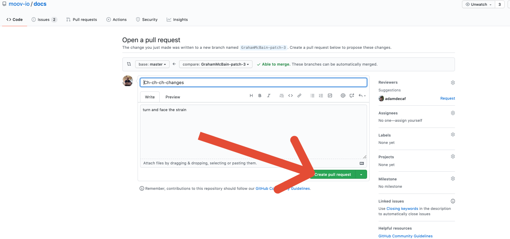

The [Moov documentation](https://docs.moov.io) is here to serve the community. We’re always interested in feedback from those using the service and especially thankful to anyone willing to contribute to it. In an effort to make contributions as easy as possible in this guide we’ll map out how to quickly and easily suggest changes to our documentation.

Oftentimes when you see an issue in an open source project the instructions for making changes are so daunting that it’s easier to just ignore them. We’re all about making your development easier and so contributing to our docs should be a similar experience. 



## docs.moov.io

While you’re reading through the documentation and you run across an issue you can make an edit very quickly. It’s as simple as clicking the edit button at the top of the page you’re reading.

Next you’ll be redirected to Github where you can make your suggested changes markdown file:

When you are done editing select “Create a new branch for this commit and start a pull request”. You’ll want to add a commit message and notes about the changes you’ve made. When you’re satisfied with your commit click the “Propose changes” button. 

Once that’s done you’ll be redirected to a page directing you to open a pull request. Click the “create pull request” button.

At this point you are done, we will see a notification of your pull request and will review it shortly. If you want to go the extra mile you can click on the “view pull request” button and share a link to your pull request in our #documentation channel. 

That’s it! You’ve successfully done your part in moving us all closer to a more inclusive and accessible financial system! If you have any questions please feel free to drop a line in our slack channel and we’ll make sure to connect with you! 

Up Next: [Part 2]()